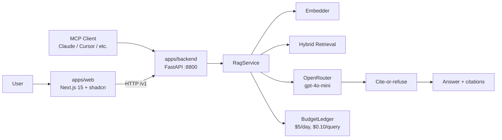

# Production RAG

Self-hosted, citation-grounded document QA. **Refuses to answer when it can't cite a real passage** — no hallucination, no fabrication, no silent failure.

> **Monorepo** — Turborepo + pnpm. Python backend (`apps/backend`), Next.js frontend (`apps/web`).

---

## Why this exists

Every RAG demo looks great on a single document. Production requires that the system say "I don't know" when the document doesn't say it, that every answer carries a citation back to a real page, and that you can prove the system works by running the same golden questions any time and getting the same pass/fail result.

That's what this project delivers.

---

## Architecture



---

## Monorepo layout

```
production-rag/
├── packages/
│   └── core/            # Python — FastAPI + FastMCP + RAG pipeline (ragcore)
│       ├── src/ragcore/ # service, api, mcp_server, retrieval, generation, budget, security, evals
│       ├── tests/
│       ├── alembic/     # 0001 initial schema (pgvector + FTS)
│       └── pyproject.toml
├── apps/
│   ├── web/             # Next.js 15 — chat UI, ingest, budget, niche switcher
│   ├── medical/         # PubMed niche (:8810)
│   ├── legal/           # CourtListener niche (:8820)
│   └── accounting/       # SEC EDGAR niche (:8830)
├── infra/               # Dockerfile + docker-compose (pgvector)
├── docs/
└── package.json
```

---

## Latest eval — v0.1.0

| Metric | Value |
| --- | --- |
| pass_rate | **75.0%** (6/8) |
| answered_rate | 66.7% (4/6 in-scope) |
| refusal_rate | **100.0%** (2/2 out-of-scope) |
| avg_latency | 2.9s |
| cost | $0.00 (free OpenRouter credits) |

Full per-case breakdown: [docs/eval_results_v0.1.0.md](docs/eval_results_v0.1.0.md)
Reproduce: `cd packages/core && EVAL_TEST=1 uv run pytest tests/test_phase7_evals.py -v -s`

## v0.2.x highlights

- `VECTOR_BACKEND=memory|postgres` — Postgres path uses pgvector HNSW + FTS (Alembic `0001`)
- Response cache (TTL), security gate (rate limit / injection / PII mask)
- Fixed + **semantic** chunkers; flag-gated **rerank** (lexical default, optional cross-encoder)
- Multipart **`POST /v1/documents/upload`** + browser drag-and-drop in the web UI
- Niche apps via `create_app(RagService(prompt_builder=...))` — no monkey-patch
- `GET /v1/documents/{id}` + MCP `get_document_status`
- CI: memory unit suite + **Postgres migrate smoke** + **offline eval regression gate**
- Golden sets: **22** core PDF cases + **50** regulatory (PT-BR BACEN/CVM/LGPD/Simples + EN ASC 606/842)
- **v0.3**: Qdrant backend + bench dual-write, always-on rerank (cross-encoder w/ lexical fallback),
  OTel→Tempo/Prometheus/Grafana compose, offline **config matrix** (`make eval-matrix`)

---

## Surfaces

### HTTP API (port 8800)

`/v1/health` · `/v1/ask` · `/v1/search` · `/v1/documents` · `/v1/documents/batch` · `/v1/budget`

### MCP (port 8801, streamable-http)

`ask_documents` · `search_documents` · `ingest_document` · `health` · `budget`

### Web UI (port 3000)

- `/` — Chat with citation rail
- `/ingest` — PDF ingest (single + batch)
- `/budget` — Daily ledger dashboard

---

## Quickstart

```bash
git clone https://github.com/joshbarros/boilerplate-productionrag.git
cd boilerplate-productionrag
pnpm install
cp apps/backend/.env.example apps/backend/.env
# Edit apps/backend/.env: set OPENROUTER_API_KEY, OPENAI_API_KEY, API_TOKEN

# Run everything
pnpm dev          # turbo runs both apps in parallel

# Or individually
pnpm --filter @production-rag/backend dev   # FastAPI :8800
pnpm --filter @production-rag/web dev       # Next.js :3000

# Tests
pnpm test                              # runs all
pnpm --filter @production-rag/backend test          # backend only (68 tests)
pnpm --filter @production-rag/backend test:eval     # live OpenRouter eval (8 cases)
```

---

## Design system

Editorial / Linear-app style. Dark surface, monospace for data, serif for emphasis, sharp micro-interactions. Full spec in [docs/design_system.md](docs/design_system.md).

- **Type**: Inter (sans) · Instrument Serif (display, italic) · JetBrains Mono (data)
- **Palette**: `#0A0A0B` bg · `#7C3AED → #06B6D4` accent gradient (rationed)
- **Surface**: hairline borders, no shadows
- **Motion**: 150–250ms ease-out, no springs

---

## What's in the box

| Phase | Feature | Status |
| --- | --- | --- |
| 2 | SQLAlchemy models, Alembic, OpenTelemetry stages | ✓ |
| 3 | PyMuPDF ingest, recursive chunking, hybrid retrieval, cite-or-refuse | ✓ |
| 4 | FastMCP server with structured tool errors + auth | ✓ |
| 5 | Docling OCR fallback for scanned PDFs, batch ingest, doc status | ✓ |
| 6 | Budget ledger, daily/query caps, `rejected_budget` response | ✓ |
| 7 | Golden-set eval suite (8 cases), scorer, runner | ✓ |
| 7.5 | Fuzzy citation verification (≥70% word overlap) | ✓ |
| 8 | Polish + ship | ✓ |
| 9 | **Monorepo (Turborepo + pnpm) + Next.js frontend** | ✓ |

What's **deferred** (in design, not fully built):
- 500k-chunk scale validation
- Full OTLP metrics histograms (traces work; Grafana metric panels are provisional)
- Live OpenRouter baseline committed (schema at `evals/results/baseline_live_schema.json`)

See [docs/limits.md](docs/limits.md) for graceful-degradation behavior.

### Observability (compose)

```bash
make up     # postgres + qdrant + otel + prometheus + tempo + grafana
make obs    # print URLs
# Grafana :3001 (admin/admin) · Prometheus :9090 · Qdrant :6333 · OTLP :4317
```

### Config matrix

```bash
make eval-matrix
# → packages/core/evals/results/matrix_core_offline.md
```

### Postgres mode

```bash
# start pgvector
docker compose -f infra/docker-compose.yml up -d postgres
# migrate
cd packages/core && uv run alembic upgrade head
# run with durable store
VECTOR_BACKEND=postgres API_TOKEN=changeme \
  uv run uvicorn ragcore.api.app:app --port 8800
```
