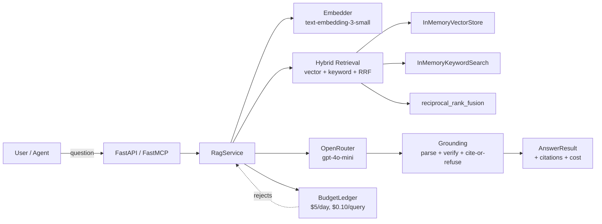

# Production RAG

Self-hosted, citation-grounded document QA. **Refuses to answer when it can't cite a real passage** — no hallucination, no fabrication, no silent failure.

Built for regulatory and fiscal PDFs where every claim must trace to a source page.

---

## Why this exists

Every RAG demo looks great on a single document. Production requires that the system say "I don't know" when the document doesn't say it, that every answer carries a citation back to a real page, and that you can prove the system works by running the same golden questions any time and getting the same pass/fail result.

That's what this project delivers.

---

## Architecture



**Two surfaces, one service layer.** HTTP and MCP are thin adapters over `ragcore.service` — guarantees can't drift.

---

## Latest eval — v0.1.0

| Metric | Value |
| --- | --- |
| pass_rate | **75.0%** (6/8) |
| answered_rate | 66.7% (4/6 in-scope) |
| refusal_rate | **100.0%** (2/2 out-of-scope) |
| avg_latency | 2.9s |
| cost | $0.00 (free OpenRouter credits) |

The two in-scope failures are bullet-list questions where the model paraphrases instead of quoting — the cite-or-refuse guard correctly downgrades these to `not_found` rather than cite a fabricated excerpt.

Full per-case breakdown: [docs/eval_results_v0.1.0.md](docs/eval_results_v0.1.0.md)
Reproduce: `EVAL_TEST=1 uv run pytest tests/test_phase7_evals.py -v -s`

---

## Surfaces

### HTTP API (port 8800)

| Method | Path | Purpose |
| --- | --- | --- |
| GET | `/v1/health` | Liveness + provider + doc count |
| POST | `/v1/ask` | Grounded answer with citations |
| POST | `/v1/search` | Retrieval-only ranked chunks |
| POST | `/v1/documents` | Ingest a single PDF |
| POST | `/v1/documents/batch` | Ingest multiple PDFs, per-doc status |
| GET | `/v1/budget` | Daily budget snapshot |

Auth: `Authorization: Bearer ${API_TOKEN}`

### MCP (port 8801, streamable-http)

| Tool | Purpose |
| --- | --- |
| `ask_documents` | Same as POST /v1/ask |
| `search_documents` | Same as POST /v1/search |
| `ingest_document` | Ingest a single PDF |
| `health` | Liveness |
| `budget` | Same as GET /v1/budget |

---

## What's in the box

| Phase | Feature | Status |
| --- | --- | --- |
| 2 | SQLAlchemy models, Alembic, OpenTelemetry stages | ✓ |
| 3 | PyMuPDF ingest, recursive chunking, hybrid retrieval, cite-or-refuse | ✓ |
| 4 | FastMCP server with structured tool errors + auth | ✓ |
| 5 | Docling OCR fallback for scanned PDFs, batch ingest, doc status | ✓ |
| 6 | Budget ledger, daily/query caps, `rejected_budget` response | ✓ |
| 7 | Golden-set eval suite (8 cases), scorer, runner | ✓ |
| 7.5 | Fuzzy citation verification (≥70% word overlap) | ✓ |
| 8 | Polish + ship | ✓ |

What's **deferred** (in design, not built):
- pgvector backend (in-memory now)
- bge-reranker cross-encoder (vector+keyword only)
- Qdrant backend comparison
- 500k-chunk scale validation

See [docs/limits.md](docs/limits.md) for graceful-degradation behavior.

---

## Quickstart

```bash
git clone <repo>
cd production-rag
uv sync
cp .env.example .env
# Edit .env: set OPENROUTER_API_KEY and API_TOKEN
make api      # FastAPI on :8800
make mcp      # FastMCP on :8801
make test     # 54 passed, 5 skipped (live/eval gated)
make eval     # 8-case golden set, gated on EVAL_TEST=1
```

---

## Configuration

All knobs are env-driven (`.env`):

| Variable | Default | Purpose |
| --- | --- | --- |
| `OPENAI_API_KEY` | "" | Embeddings (text-embedding-3-small) |
| `OPENROUTER_API_KEY` | "" | LLM generation |
| `OPENROUTER_DEFAULT_MODEL` | `openai/gpt-4o-mini` | Generation model |
| `OPENROUTER_REASONING_EFFORT` | `none` | `none`/`low`/`high` |
| `API_TOKEN` | (required) | HTTP + MCP auth |
| `DAILY_BUDGET_USD` | 5.00 | Per-day cost cap |
| `QUERY_BUDGET_USD` | 0.10 | Per-query cost cap |
| `OCR_ENABLED` | true | Docling fallback for scanned PDFs |
| `MCP_PORT` | 8801 | MCP listen port |
| `API_PORT` | 8800 | API listen port |

---

## Repo layout

```
src/ragcore/
├── service.py           # The only thing API and MCP call
├── api/app.py           # FastAPI HTTP surface
├── mcp_server/app.py    # FastMCP tool surface
├── ingestion/loader.py  # PyMuPDF + Docling OCR
├── chunking/recursive.py
├── embedding/provider.py
├── retrieval/{fts, fusion, vector_pg}.py
├── generation/{router, prompts, grounding}.py
├── budget/ledger.py     # Daily/query cap enforcement
└── evals/               # Golden set + scorer + runner
```

---

## License

See [LICENSE](LICENSE).
